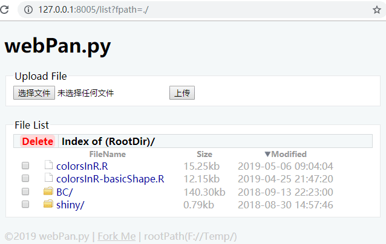

# 网盘 webPan.py
目的： 用于局域网内文件短暂共享，可以不用U盘了。

todo 加入多用户功能，文件能设置私有、公开(需要使用数据库)、按口令公开

todo 拖拽上传




# 环境
- depend: Python3 flask
- test OS: win10, Ubuntu 1804
- version: 0.2
```
C:\Users\admin>flask --version
Flask 1.0.2
Python 3.6.4 (v3.6.4:d48eceb, Dec 19 2017, 06:54:40) [MSC v.1900 64 bit (AMD64)]

$ flask --version
Flask 1.0.2
Python 3.6.8 (default, Aug 20 2019, 17:12:48) 
[GCC 8.3.0]
```


# 现有功能
- 在webPanLib.py中定义根目录
- 浏览和下载文件
- 上传文件
- 删除一个或多个文件到回收站/dustbin/，在回收站删除则彻底删除;
- 支持跨域请求静态文件，API是 /file/xx.mp3
	已经添加外链，并图标显示，可右击复制外链。
	例如，网盘显示为 audio/xx.mp3的文件，可以外网访问 init('http://y.biomooc.com:8000/file/audio/xx.mp3')
- 支持预览pdf
- todo 新建文件夹
- todo 多用户支持


# 运行方式 How to run
1. 下载项目；
2. 设置 
 - 安装python3的包 $ pip install flask
 - 如果提示缺少其他包，继续安装缺少的包，比如 $ pip install 
 - webPanLib.py中的rootPath为存在的路径(有默认值，但是不一定存在该文件夹，如果不可写，则无法上传文件);
 - 修改index.py最后一行为合适的ip和端口号(有默认值，但是不一定可用);
3. 进入目录，运行 $ python index.py  #会提示url
4. 在浏览器打开url。
5. 单击文件下载。


# 项目文件结构
```
|-- index.py 入口文件
|-- webPanLib.py 定义函数和常量
|-- static/
    |--css/
        |--webPan.css
    |--js/
        |--main.js
    |--images/
|-- ReadMe.txt 说明文档
|-- dustbin/ 回收站
```

